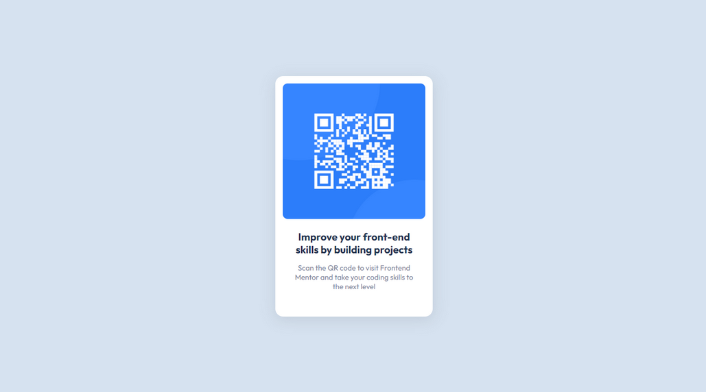

# Frontend Mentor - QR code component solution

Built with React JS

This is a solution to the [QR code component challenge on Frontend Mentor](https://www.frontendmentor.io/challenges/qr-code-component-iux_sIO_H). Frontend Mentor challenges help you improve your coding skills by building realistic projects.

## Table of contents

- [Overview](#overview)
  - [Screenshot](#screenshot)
  - [Links](#links)
  - [Built with](#built-with)
  - [Continued development](#continued-development)
- [Author](#author)
- [Acknowledgments](#acknowledgments)

## Overview

### Screenshots

<!-- Mobile and Desktop View -->

### Links

- Solution URL: [https://github.com/kriz-falcasantos/fm_qr-code-component](https://github.com/kriz-falcasantos/fm_qr-code-component)
- Live Site URL: [https://fmkriz-qrcode-component.netlify.app](https://fmkriz-qrcode-component.netlify.app)

### Built with

- CSS custom properties
- Vite JS
- React Components
- [React](https://reactjs.org/) - JS library

### Continued development

Master Frontend Development with React

## Author

- Facebook - [Krizelle Falcasantos](https://www.facebook.com/krizellemaebfalcasantos)
- Frontend Mentor - [@kriz-falcasantos](https://www.frontendmentor.io/profile/kriz-falcasantos)
